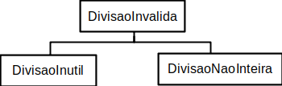

# Estrutura de Arquivos e Pastas

~~~
├── README.md          <- apresentação do projeto
│
├── src                <- projeto em Java (preferencialmente projeto no Eclipse)
│   │
│   ├── Interpol           <- arquivos-fonte do projeto (.java)
│   │
│   └── README.md      <- instruções básicas de instalação/execução
│
├── bin
|   |
|   └── Interpol       <- arquivos em bytecode (.class)
│
└── assets             <- mídias usadas no projeto
~~~

## `assets`

# Modelo para Apresentação do Projeto

Este é um guia de como produzir documentação em Markdown. Para entender como criar documentos em Markdown no Github, veja o material/vídeo:
[Guia de Uso do Markdown](https://github.com/mc-unicamp/oficinas/tree/master/docs).

Vide detalhes sobre o Markdown em: [Mastering Markdown](https://guides.github.com/features/mastering-markdown/).

E mais especificamente sobre tabelas em: [Organizing information with tables](https://help.github.com/en/articles/organizing-information-with-tables)

Segue abaixo o modelo de como deve ser documentado o projeto e cada componente do projeto. Tudo o que for indicado entre `<...>` indica algo que deve ser substituído pelo indicado. No modelo são colocados exemplos ilustrativos, que serão substituídos pelos do seu projeto.

Para a construção dos diagramas, devem ser usados modelos disponíveis em: [Diagramas de Classes, Interfaces e Componentes](https://docs.google.com/presentation/d/1ML3WrnDtzh-4wqLmdXN9au1TBIwEqo7TIbMLNOYSMAI/edit?usp=sharing)

# Projeto `Interpol`

# Descrição Resumida do Projeto/Jogo
* O projeto é uma versão simplificada do jogo Interpol, o tabuleiro é composto de 50 estações, sendo estas de Metrô, Ônibus ou Táxi. O jogador controla 4 peças que representam os detetives, já o computador controla o MisterX, cada peça começa em uma estação diferente no tabuleiro. O objetivo do jogo é estar na mesma casa do MisterX em até 12 rodadas, caso contrário o MisterX vencerá. O MisterX move-se escondido pelo tabuleiro, sendo que toda rodada é revelado o meio de transporte que ele utilizou para se locomover, e sendo revelada a sua posição apenas nas rodadas 2, 6 e 10, e na última caso MisterX vença.
  * Todas as peças se movem da seguinte forma:
    * Caso estejam em uma estação de metrô:
      * Podem se mover para uma estação de metrô vizinha utilizando o metrô, podem se mover para uma estação de ônibus vizinha utilizando ônibus, e podem se mover para uma estação de táxi vizinha utilizando táxi.
    * Caso estejam em uma estação de ônibus:
      * Podem se mover para uma estação de metrô vizinha utilizando ônibus, podem se mover para uma estação de ônibus vizinha utilizando õnibus, e podem se mover para uma estação de táxi vizinha utilizando táxi.
    * Caso estejam em uma estação de táxi:
      * Podem se mover para uma estação de metrô, ônibus ou taxi vizinhas utilizando táxi

# Equipe
* `Caio Ruiz Coldebella` - `232621`

# Vídeos do Projeto

## Vídeo da Prévia
* [Prévia Interpol](https://www.youtube.com/watch?v=-aVv7dPcn2w&t=2s)

## Vídeo do Jogo
* [Demonstração do Jogo](https://www.youtube.com/watch?v=b_18EhfYALQ&t=54s)

# Slides do Projeto

## Slides da Prévia
* [Slides Prévia](https://docs.google.com/presentation/d/1S1_0Auh7A4Bnty0BI946roO-Hn6JHsnYs1UAQwbwXwI/edit?usp=sharing)

## Slides da Apresentação Final
`<Coloque um link para os slides da apresentação final do projeto.>`

## Relatório de Evolução

> <Relatório de evolução, descrevendo as evoluções do design do projeto, dificuldades enfrentadas, mudanças de rumo, melhorias e lições aprendidas. Referências aos diagramas e recortes de mudanças são bem-vindos.>

# Destaques de Código

> <Escolha trechos relevantes e/ou de destaque do seu código. Apresente um recorte (você pode usar reticências para remover partes menos importantes). Veja como foi usado o highlight de Java para o código.>

~~~java
// Recorte do seu código
public void algoInteressante(…) {
   …
   trechoInteressante = 100;
}
~~~

# Destaques de Pattern
`<Destaque de patterns adotados pela equipe. Sugestão de estrutura:>`

## Diagrama do Pattern
`<Diagrama do pattern dentro do contexto da aplicação.>`

## Código do Pattern
~~~java
// Recorte do código do pattern seguindo as mesmas diretrizes de outros destaques
public void algoInteressante(…) {
   …
   trechoInteressante = 100;
}
~~~

> <Explicação de como o pattern foi adotado e quais suas vantagens, referenciando o diagrama.>

# Documentação dos Componentes

# Diagramas

## Diagrama Geral do Projeto

No diagrama podemos ver que a classe mainwindow recebe e envia informações diretamente para Tabuleiro, MisterX, Policia, Estacao e Rodadas.
Recebe e envia para thread, e envia informações para windowbotao.
Imagem envia para windowbotao, e windowbotao envia informações para thread

## Diagrama Geral de Componentes

## Componente `EstMetro`

Representa cada uma das estações de metrô, e definirá se as peças ocupam estas estações, assim como armazenará informaçoes sobre suas estações vizinhas.

**Ficha Técnica**
item | detalhamento
----- | -----
Classe | `MC322.src.Entrega_Final_do_Trabalho.src.Interpol.EstMetro`
Autores | `Caio Ruiz Coldebella`
Interfaces | `Estacao`

### Interfaces

Interfaces associadas a esse componente:

Interface agregadora do componente em Java:

~~~java
public interface Estacao {
	public String getOcupada();
	public void setOcupada(String ocup);
	public Estacao[] getvizinhanca();
	public void addvizinho(Estacao vizinho);
}
~~~
## Componente `EstOnibus`

Representa cada uma das estações de ônibus, e definirá se as peças ocupam estas estações, assim como armazenará informaçoes sobre suas estações vizinhas.

**Ficha Técnica**
item | detalhamento
----- | -----
Classe | `MC322.src.Entrega_Final_do_Trabalho.src.Interpol.EstOnibus`
Autores | `Caio Ruiz Coldebella`
Interfaces | `Estacao`

### Interfaces

Interfaces associadas a esse componente:

Interface agregadora do componente em Java:

~~~java
public interface Estacao {
	public String getOcupada();
	public void setOcupada(String ocup);
	public Estacao[] getvizinhanca();
	public void addvizinho(Estacao vizinho);
}
~~~
## Componente `EstTaxi`

Representa cada uma das estações de táxi, e definirá se as peças ocupam estas estações, assim como armazenará informaçoes sobre suas estações vizinhas.

**Ficha Técnica**
item | detalhamento
----- | -----
Classe | `MC322.src.Entrega_Final_do_Trabalho.src.Interpol.EstTaxi`
Autores | `Caio Ruiz Coldebella`
Interfaces | `Estacao`

### Interfaces

Interfaces associadas a esse componente:

Interface agregadora do componente em Java:

~~~java
public interface Estacao {
	public String getOcupada();
	public void setOcupada(String ocup);
	public Estacao[] getvizinhanca();
	public void addvizinho(Estacao vizinho);
}
~~~
## Componente `MisterX`

Representar a peça do MisterX, assim como sortear para qual estação ele se moverá

**Ficha Técnica**
item | detalhamento
----- | -----
Classe | `MC322.src.Entrega_Final_do_Trabalho.src.Interpol.MisterX`
Autores | `Caio Ruiz Coldebella`
Interfaces | `IMisterX`

### Interfaces

Interfaces associadas a esse componente:

Interface agregadora do componente em Java:

~~~java
public interface IMisterX {
	public int getpos();
	public void setpos(int posicao);
	public void random();
}
~~~
## Detalhamento das Interfaces

### Interface `<nome da interface>`

`<Resumo do papel da interface.>`

~~~
<Interface em Java.>
~~~

Método | Objetivo
-------| --------
`<id do método em Java>` | `<objetivo do método e descrição dos parâmetros>`

## Exemplo:

### Interface `ITableProducer`

Interface provida por qualquer fonte de dados que os forneça na forma de uma tabela.

~~~java
public interface ITableProducer {
  String[] requestAttributes();
  String[][] requestInstances();
}
~~~

Método | Objetivo
-------| --------
`requestAttributes` | Retorna um vetor com o nome de todos os atributos (colunas) da tabela.
`requestInstances` | Retorna uma matriz em que cada linha representa uma instância e cada coluna o valor do respectivo atributo (a ordem dos atributos é a mesma daquela fornecida por `requestAttributes`.

### Interface `IDataSetProperties`

Define o recurso (usualmente o caminho para um arquivo em disco) que é a fonte de dados.

~~~java
public interface IDataSetProperties {
  public String getDataSource();
  public void setDataSource(String dataSource);
}
~~~

Método | Objetivo
-------| --------
`getDataSource` | Retorna o caminho da fonte de dados.
`setDataSource` | Define o caminho da fonte de dados, informado através do parâmetro `dataSource`.

# Plano de Exceções

## Diagrama da hierarquia de exceções
`<Elabore um diagrama com a hierarquia de exceções como detalhado abaixo>`

## Descrição das classes de exceção

`<Monte uma tabela descritiva seguindo o exemplo>:`

Classe | Descrição
----- | -----
DivisaoInvalida | Engloba todas as exceções de divisões não aceitas.
DivisaoInutil | Indica que a divisão por 1 é inútil.
DivisaoNaoInteira | Indica uma divisão não inteira.

